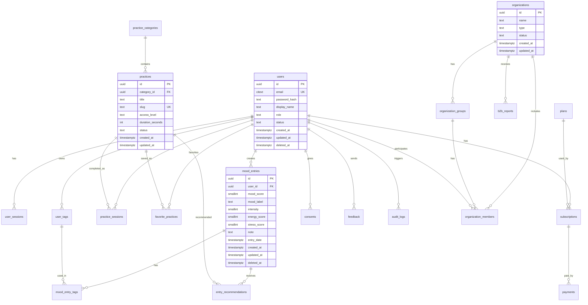

# «Эмоции Гид»: функциональные и нефункциональные требования, User Stories, схема БД и итоговый стек

Дата версии: 23 мая 2026 года  
Версия документа: 1.0  
Статус: проектное ТЗ для MVP → пилота → коммерческого запуска

---

## 1. Контекст и целевое состояние продукта

«Эмоции Гид» должен развиваться как кроссплатформенная веб-платформа для самонаблюдения, а не как медицинский, диагностический или консультационный сервис.

Правильная продуктовая формулировка:

> «Эмоции Гид» — веб-платформа для пользователей 18+, где можно быстро отметить настроение, сохранить личную заметку, выбрать короткую практику, посмотреть динамику и получить мягкие рекомендации для самонаблюдения без медицинской диагностики и без замены специалиста.

Коммерческая логика продукта:

- B2C: бесплатный базовый дневник настроения + premium-подписка.
- B2B: доступ для организаций, пилотные группы, обезличенная статистика активности.
- AI/NLP: вспомогательный модуль классификации записей и подбора практик, а не «ИИ-психолог».
- Информационная безопасность: privacy by design, минимизация данных, разграничение доступа, аудит действий, удаление данных.

Ключевой принцип: продукт должен продавать не «лечение» и не «психологическую помощь», а регулярную привычку самонаблюдения и готовый цифровой wellness-инструмент.

---

## 2. Границы продукта

### 2.1. Что продукт делает

Продукт позволяет пользователю:

- зарегистрироваться и войти в личный кабинет;
- отметить текущее настроение;
- добавить личную заметку;
- указать контекст записи: учеба, работа, сон, отношения, здоровье, отдых, финансы, другое;
- выбрать интенсивность состояния;
- открыть короткую практику: дыхание, расслабление, рефлексия, grounding, пауза;
- сохранить запись в историю;
- смотреть календарь и динамику записей;
- получать мягкие рекомендации на основе собственных записей;
- настроить напоминания;
- управлять приватностью и удалением данных;
- оформить premium-доступ;
- в B2B-сценарии подключиться к пилотной группе организации.

Продукт позволяет организации:

- создать организационный кабинет;
- пригласить пользователей в пилотную группу;
- видеть обезличенную статистику активности;
- отслеживать вовлеченность без доступа к личным записям;
- выгружать агрегированные отчеты;
- публиковать подборки практик для группы;
- использовать продукт как часть well-being, адаптационной или профилактической программы.

### 2.2. Что продукт не делает

Продукт не должен:

- ставить медицинские или психологические диагнозы;
- определять депрессию, тревожное расстройство, ПТСР и другие состояния;
- заменять психолога, психотерапевта, врача или кризисную помощь;
- обещать лечение, улучшение психического здоровья или клинический эффект;
- давать директивные советы по медицинским вопросам;
- предоставлять организациям доступ к личным заметкам пользователя;
- продавать чувствительные персональные данные;
- использовать пользовательские записи для B2B-аналитики в идентифицируемом виде.

---

## 3. Роли пользователей

### 3.1. Гость

Неавторизованный пользователь, который может:

- открыть лендинг;
- прочитать описание продукта;
- посмотреть публичный каталог части практик;
- прочитать дисклеймеры;
- перейти к регистрации;
- оставить заявку на B2B-пилот;
- посмотреть тарифы.

### 3.2. B2C-пользователь Free

Авторизованный пользователь с бесплатным тарифом. Может:

- вести дневник настроения;
- создавать ограниченное количество записей в месяц, если команда решит вводить лимит;
- использовать базовые практики;
- видеть простую динамику;
- редактировать профиль;
- удалять свои записи;
- экспортировать ограниченный набор данных или не иметь экспорта, в зависимости от тарифной политики.

Рекомендуемый вариант для старта: не ограничивать количество записей резко. Лучше ограничить продвинутую аналитику, экспорт и персонализацию.

### 3.3. B2C-пользователь Premium

Платный пользователь. Может:

- вести неограниченную историю;
- получать расширенную аналитику;
- использовать расширенный каталог практик;
- включать напоминания;
- экспортировать историю;
- получать персональные подборки практик;
- использовать AI/NLP-помощника для структурирования записей;
- задавать личные цели самонаблюдения;
- видеть недельные и месячные отчеты.

### 3.4. Участник B2B-группы

Пользователь, приглашенный организацией. Может:

- использовать базовый или расширенный функционал в рамках пилота;
- присоединиться к организации по ссылке, коду или email-инвайту;
- выйти из группы;
- видеть, какие данные передаются организации;
- запретить передачу части необязательных данных, если это предусмотрено политикой;
- сохранять личные записи приватными.

### 3.5. Администратор организации

Представитель вуза, компании, молодежного объединения или НКО. Может:

- создать организацию;
- настроить пилотную группу;
- приглашать участников;
- видеть число регистраций, активных пользователей, записей, использованных практик;
- видеть агрегированную динамику по группе без персональных записей;
- выгружать отчеты;
- создавать подборки практик;
- видеть обратную связь по продукту;
- управлять доступами внутри организации.

### 3.6. Суперадминистратор платформы

Член команды «Эмоции Гид». Может:

- управлять пользователями;
- управлять практиками и контентом;
- модерировать обращения;
- управлять организациями;
- видеть технические метрики;
- управлять тарифами;
- просматривать логи действий в рамках политики безопасности;
- не должен читать личные записи пользователей без явно предусмотренного технического/юридического основания.

### 3.7. Контент-редактор

Участник команды, отвечающий за практики и материалы. Может:

- создавать и редактировать практики;
- назначать категории и теги;
- публиковать и снимать материалы;
- смотреть статистику использования практик;
- не имеет доступа к личным дневникам пользователей.

---

## 4. Функциональные требования

Нумерация требований используется для дальнейшей разработки, тестирования и защиты проекта.

---

## 4.1. Публичный сайт и лендинг

### FR-LANDING-001. Первый экран

Система должна показывать на главной странице краткое позиционирование продукта.

Текстовый смысл:

- «Дневник настроения»;
- «личные заметки»;
- «короткие практики»;
- «динамика»;
- «работает в браузере»;
- «не является медицинским сервисом».

Критерии приемки:

- Пользователь за 5–10 секунд понимает, что это дневник настроения, а не сервис психотерапии.
- На первом экране нет слов «диагностика», «лечение», «ИИ-психолог», «психотерапия».
- Есть CTA: «Начать бесплатно».

### FR-LANDING-002. Блок сценария использования

Система должна показывать простой путь пользователя:

1. Отметить настроение.
2. Добавить заметку.
3. Выбрать практику.
4. Посмотреть динамику.

Критерии приемки:

- Сценарий описан без сложной терминологии.
- Каждый шаг содержит короткое описание.
- На мобильном экране блок читается без горизонтальной прокрутки.

### FR-LANDING-003. Блок B2C-ценности

Система должна объяснять пользу для пользователя 18+:

- быстрее фиксировать состояние;
- видеть повторяющиеся факторы;
- сохранять личные наблюдения;
- возвращаться к полезным практикам;
- формировать привычку самонаблюдения.

### FR-LANDING-004. Блок B2B-ценности

Система должна объяснять пользу для организаций:

- быстрый запуск wellness-инструмента;
- вовлечение аудитории;
- обезличенная статистика активности;
- отсутствие необходимости разрабатывать собственную платформу;
- пилотный формат внедрения.

### FR-LANDING-005. Дисклеймер

Система должна показывать дисклеймер:

> «Эмоции Гид» не является медицинским, диагностическим или консультационным сервисом. Платформа не ставит диагнозы, не заменяет психолога, психотерапевта или врача. Материалы носят информационно-просветительский характер.

Критерии приемки:

- Дисклеймер доступен на лендинге.
- Дисклеймер доступен в футере.
- Дисклеймер доступен перед использованием AI/NLP-рекомендаций.

### FR-LANDING-006. Тарифы

Система должна отображать тарифы:

- Free;
- Premium;
- B2B Pilot;
- B2B Organization.

На MVP можно показывать тарифы как «планируемые» без реальной оплаты.

### FR-LANDING-007. Форма заявки на B2B-пилот

Система должна позволять оставить заявку на пилот.

Поля:

- имя;
- организация;
- роль;
- email;
- телефон, опционально;
- размер аудитории;
- комментарий.

Критерии приемки:

- Заявка сохраняется в БД.
- Команда получает уведомление в админке или на email/Telegram.
- Пользователь видит подтверждение отправки.

---

## 4.2. Авторизация и аккаунт

### FR-AUTH-001. Регистрация по email

Система должна позволять пользователю зарегистрироваться по email и паролю.

Поля:

- email;
- пароль;
- повтор пароля;
- имя или nickname;
- подтверждение возраста 18+;
- согласие с пользовательским соглашением;
- согласие с политикой обработки персональных данных.

Критерии приемки:

- Email валидируется.
- Пароль проверяется по политике сложности.
- Без согласия с документами регистрация невозможна.
- Без подтверждения 18+ регистрация невозможна.
- После регистрации создается профиль пользователя.

### FR-AUTH-002. Вход по email

Система должна позволять пользователю войти по email и паролю.

Критерии приемки:

- При успешном входе пользователь попадает в личный кабинет.
- При ошибке показывается нейтральное сообщение без раскрытия, существует ли email.
- Создается запись в журнале security events.

### FR-AUTH-003. Выход из аккаунта

Система должна позволять пользователю выйти из аккаунта.

Критерии приемки:

- Access token удаляется на клиенте.
- Refresh token отзывается на backend.
- Пользователь перенаправляется на публичную страницу.

### FR-AUTH-004. Восстановление пароля

Система должна позволять восстановить пароль через email.

Критерии приемки:

- Пользователь запрашивает ссылку восстановления.
- Ссылка одноразовая и имеет срок действия.
- После смены пароля старые refresh-токены отзываются.

### FR-AUTH-005. Смена email

Система должна позволять сменить email с подтверждением нового адреса.

Критерии приемки:

- Пользователь вводит новый email.
- На новый email отправляется подтверждение.
- До подтверждения старый email остается активным.
- Смена фиксируется в audit log.

### FR-AUTH-006. Смена пароля

Система должна позволять сменить пароль из профиля.

Критерии приемки:

- Требуется текущий пароль.
- Новый пароль соответствует политике.
- После смены пароля все активные сессии, кроме текущей или включая текущую по политике, инвалидируются.

### FR-AUTH-007. Управление сессиями

Система должна хранить refresh-сессии и позволять пользователю завершать активные сессии.

Критерии приемки:

- Пользователь видит список устройств/сессий.
- Пользователь может завершить отдельную сессию.
- Суперадминистратор может принудительно завершить сессии при инциденте.

### FR-AUTH-008. OAuth-вход, опционально

После MVP система может поддерживать вход через Яндекс ID, VK ID или Google.

Рекомендация: для первого пилота не усложнять. Email+password достаточно.

---

## 4.3. Профиль пользователя

### FR-PROFILE-001. Просмотр профиля

Система должна показывать:

- имя/nickname;
- email;
- дату регистрации;
- текущий тариф;
- принадлежность к B2B-группе, если есть;
- настройки приватности;
- настройки уведомлений.

### FR-PROFILE-002. Редактирование имени

Система должна позволять изменить имя/nickname.

Критерии приемки:

- Имя не пустое.
- Имя проходит базовую санитарную проверку.
- Изменение сохраняется и отображается без перезагрузки.

### FR-PROFILE-003. Удаление аккаунта

Система должна позволять пользователю удалить аккаунт.

Варианты:

- мягкое удаление с периодом восстановления 14–30 дней;
- полное удаление персональных данных после периода восстановления.

Критерии приемки:

- Перед удалением показывается предупреждение.
- Пользователь подтверждает действие.
- Личные записи удаляются или анонимизируются согласно политике.
- B2B-агрегаты не позволяют восстановить личность пользователя.

### FR-PROFILE-004. Экспорт данных

Premium-пользователь должен иметь возможность экспортировать свои записи.

Форматы:

- PDF;
- CSV;
- JSON, опционально.

Для Free можно дать ограниченный экспорт последнего месяца или не давать экспорт как premium-функцию.

---

## 4.4. Дневник настроения

### FR-DIARY-001. Быстрая запись настроения

Система должна позволять создать запись за 30–90 секунд.

Поля:

- настроение: шкала 1–5 или 1–10;
- эмоция/состояние: радость, спокойствие, усталость, тревога, раздражение, грусть, вдохновение, неопределенность, другое;
- интенсивность: низкая, средняя, высокая или шкала 1–10;
- заметка: текст до заданного лимита;
- контексты/теги;
- выбранная практика, если пользователь ее прошел.

Критерии приемки:

- Пользователь может сохранить запись без текстовой заметки.
- Пользователь может сохранить запись только с настроением.
- После сохранения запись появляется в истории.
- Запись привязана к текущему пользователю.

### FR-DIARY-002. Расширенная запись

Система должна позволять добавить расширенные поля:

- сон: плохо/нормально/хорошо или часы сна;
- энергия: 1–10;
- стресс/нагрузка: 1–10;
- социальный контекст: один/с друзьями/семья/работа/учеба;
- физическая активность: да/нет/уровень;
- произвольные теги.

Эти поля не должны быть обязательными.

### FR-DIARY-003. Редактирование записи

Система должна позволять редактировать свои записи.

Критерии приемки:

- Пользователь может редактировать только собственные записи.
- История изменения может храниться технически, если это нужно для аудита, но не должна быть видна организации.
- Обновляется поле `updated_at`.

### FR-DIARY-004. Удаление записи

Система должна позволять удалить запись.

Критерии приемки:

- Пользователь может удалить только собственную запись.
- Запись мягко удаляется или полностью удаляется в зависимости от политики.
- Удаленная запись не попадает в пользовательскую аналитику.

### FR-DIARY-005. Черновик записи

Система может сохранять черновик, если пользователь начал вводить заметку и ушел со страницы.

Рекомендация: отложить после MVP.

### FR-DIARY-006. Приватность записи

Система должна позволять явно показать, что записи приватны.

Для B2B-пользователя интерфейс должен объяснять:

- организация не видит текст заметок;
- организация видит только обезличенную статистику активности;
- пользователь может выйти из группы.

---

## 4.5. История записей и календарь

### FR-HISTORY-001. Список записей

Система должна показывать список записей пользователя.

Фильтры:

- период;
- настроение;
- эмоция;
- тег;
- использованная практика;
- наличие заметки.

### FR-HISTORY-002. Календарный вид

Система должна показывать календарь с отметками дней, когда были записи.

Критерии приемки:

- День с записью визуально отличается.
- При клике на день показываются записи.
- На мобильном экране календарь не ломает верстку.

### FR-HISTORY-003. Поиск по заметкам

Premium-пользователь должен иметь поиск по своим заметкам.

Критерии приемки:

- Поиск работает только по данным текущего пользователя.
- Результаты сортируются по релевантности или дате.
- Запросы не раскрываются другим пользователям или организациям.

---

## 4.6. Практики саморегуляции

### FR-PRACTICE-001. Каталог практик

Система должна содержать каталог практик.

Типы практик:

- дыхательные;
- расслабляющие;
- рефлексивные;
- grounding;
- короткая пауза;
- подготовка ко сну;
- концентрация;
- восстановление после нагрузки.

Поля практики:

- название;
- описание;
- категория;
- длительность;
- уровень сложности;
- теги;
- текст инструкции;
- предупреждения/ограничения;
- статус публикации.

### FR-PRACTICE-002. Карточка практики

Система должна показывать карточку практики:

- цель практики;
- длительность;
- пошаговую инструкцию;
- кнопку «Начать»;
- кнопку «Добавить в избранное»;
- кнопку «Отметить как выполненную».

### FR-PRACTICE-003. Дыхательный таймер

Система должна поддерживать дыхательные упражнения с фазами.

Минимально:

- вдох;
- задержка;
- выдох;
- пауза/отдых.

Параметры:

- длительность каждой фазы;
- число циклов;
- звуковые сигналы, опционально;
- визуальная анимация.

### FR-PRACTICE-004. Медитационный/фокус-таймер

Система должна поддерживать таймер:

- 3 минуты;
- 5 минут;
- 10 минут;
- 15 минут;
- пользовательское время, premium.

### FR-PRACTICE-005. История выполненных практик

Система должна сохранять факт выполнения практики.

Поля:

- пользователь;
- практика;
- дата/время;
- длительность;
- была ли привязана к дневниковой записи;
- оценка полезности, опционально.

### FR-PRACTICE-006. Избранные практики

Система должна позволять сохранять практики в избранное.

### FR-PRACTICE-007. Рекомендация практики после записи

После создания записи система должна предложить 1–3 практики.

MVP-логика:

- если настроение низкое и энергия низкая — мягкая восстановительная практика;
- если напряжение высокое — дыхательная или grounding-практика;
- если настроение нейтральное — рефлексивная практика;
- если настроение хорошее — практика закрепления позитивного состояния.

AI/NLP-логика после MVP:

- учитывать теги;
- учитывать историю пользователя;
- учитывать практики, которые пользователь уже оценивал полезными;
- классифицировать заметку по темам без диагностики.

---

## 4.7. Аналитика и динамика для пользователя

### FR-ANALYTICS-001. Базовая динамика

Система должна показывать:

- среднее настроение за неделю;
- среднее настроение за месяц;
- количество записей;
- streak регулярности;
- распределение настроений;
- часто встречающиеся теги.

### FR-ANALYTICS-002. График настроения

Система должна показывать график настроения по датам.

Критерии приемки:

- Данные идут в хронологическом порядке.
- График корректно работает при 0, 1, 2 и большом количестве записей.
- Пользователь может выбрать период: неделя, месяц, 3 месяца, год, все время.

### FR-ANALYTICS-003. Аналитика тегов

Система должна показывать связь настроения с тегами.

Пример:

- «В дни с тегом “сон” настроение чаще ниже среднего».
- «Практика “дыхание 4-7-8” часто используется после записей с высоким напряжением».

Важно: формулировки должны быть осторожными. Не писать «причина ухудшения» — писать «чаще встречается вместе».

### FR-ANALYTICS-004. Premium-аналитика

Premium-пользователь получает:

- расширенные периоды;
- сравнение недель;
- тематические отчеты;
- экспорт;
- персональные инсайты;
- рекомендации по практикам;
- цели регулярности.

### FR-ANALYTICS-005. Недельный отчет

Система должна формировать отчет за неделю.

Содержание:

- число записей;
- среднее настроение;
- наиболее частые теги;
- использованные практики;
- мягкий вывод;
- предложение на следующую неделю.

Отчет не должен содержать медицинских выводов.

---

## 4.8. Рекомендательный модуль и AI/NLP

### FR-AI-001. Название модуля

Модуль не должен называться «ИИ-психолог».

Допустимые названия:

- «Помощник самонаблюдения»;
- «Подбор практик»;
- «Рекомендации»;
- «Ассистент дневника».

### FR-AI-002. Классификация заметки

Система может классифицировать пользовательскую заметку по темам.

Примеры тем:

- учеба;
- работа;
- сон;
- отношения;
- усталость;
- неопределенность;
- отдых;
- финансы;
- здоровье без медицинской детализации;
- другое.

Запрещено:

- ставить диагноз;
- определять расстройство;
- делать клинический вывод;
- присваивать пользователю медицинский статус.

### FR-AI-003. Подбор практик

Система может рекомендовать практики на основе:

- выбранного настроения;
- тегов;
- истории выполненных практик;
- оценки полезности практик;
- пользовательских предпочтений.

### FR-AI-004. Объяснение рекомендации

Система должна объяснять рекомендацию простым языком.

Пример корректной формулировки:

> «Вы отметили усталость и низкую энергию. Можно попробовать короткую восстановительную практику на 3 минуты.»

Некорректная формулировка:

> «У вас признаки выгорания, выполните эту практику.»

### FR-AI-005. Ограничения AI

Перед использованием AI/NLP-модуля система должна показывать ограничение:

- рекомендации не являются консультацией;
- ответы могут быть неточными;
- при тяжелом состоянии нужно обратиться к специалисту или экстренным службам;
- пользователь не должен вводить лишние чувствительные данные.

### FR-AI-006. Контроль безопасности ответов

Ответ AI должен проходить фильтрацию.

Фильтры:

- запрет диагнозов;
- запрет медицинских назначений;
- запрет опасных советов;
- кризисный fallback;
- удаление reasoning/служебных блоков модели;
- логирование технических ошибок без сохранения лишнего текста.

### FR-AI-007. Кризисный сценарий

Если пользователь вводит текст с признаками угрозы себе или другим, система должна:

- не пытаться консультировать глубоко;
- показать кризисное сообщение;
- предложить обратиться к экстренной помощи, близкому человеку или профильной линии поддержки;
- при необходимости показать регионально нейтральную формулировку;
- не обещать, что сервис решит ситуацию.

Важно: реализация кризисного сценария требует отдельной юридической и этической проработки.

---

## 4.9. Напоминания

### FR-REMINDER-001. Настройка напоминаний

Premium-пользователь должен иметь возможность настроить напоминания.

Параметры:

- дни недели;
- время;
- тип: запись настроения, практика, недельный отчет;
- канал: email, web push, Telegram bot в будущем.

### FR-REMINDER-002. Мягкая формулировка напоминаний

Напоминания не должны давить на пользователя.

Корректно:

> «Можно отметить настроение за сегодня.»

Некорректно:

> «Вы снова забыли вести дневник.»

---

## 4.10. Premium и оплата

### FR-PAYMENT-001. Тарифы

Система должна поддерживать тарифы:

- Free;
- Premium Monthly;
- Premium Annual;
- B2B Pilot;
- B2B Organization.

### FR-PAYMENT-002. Ограничение функций по тарифу

Система должна проверять доступ к premium-функциям на backend, а не только на frontend.

Premium-функции:

- расширенная аналитика;
- экспорт;
- напоминания;
- персональные рекомендации;
- расширенный каталог практик;
- расширенная история;
- цели и привычки.

### FR-PAYMENT-003. Интеграция платежей

Для РФ-рынка возможные варианты:

- ЮKassa;
- CloudPayments;
- Robokassa;
- Тинькофф/Kassa;
- платежи через B2B-счет для организаций.

Рекомендация: для MVP сначала реализовать тарифную модель без платежной интеграции, затем подключать платежи после подтверждения спроса.

### FR-PAYMENT-004. История платежей

Система должна хранить историю платежей и статусы подписок.

Статусы:

- active;
- trial;
- past_due;
- cancelled;
- expired;
- refunded.

---

## 4.11. B2B-кабинет

### FR-B2B-001. Создание организации

Система должна позволять суперадминистратору или заявителю создать организацию.

Поля:

- название;
- тип: вуз, колледж, компания, НКО, молодежное объединение;
- регион;
- контактное лицо;
- email;
- статус договора/пилота;
- тариф.

### FR-B2B-002. Группы внутри организации

Система должна поддерживать группы.

Примеры:

- «Пилот КГУ, май 2026»;
- «Первокурсники»;
- «HR Well-being, отдел разработки».

### FR-B2B-003. Приглашение участников

Способы приглашения:

- ссылка-инвайт;
- код группы;
- email-инвайты;
- импорт списка email, после юридической проверки.

### FR-B2B-004. Согласие пользователя на участие

Пользователь должен явно подтвердить участие в группе.

Интерфейс должен показать:

- кто организатор;
- какие данные видит организация;
- какие данные не видит организация;
- как выйти из группы.

### FR-B2B-005. Обезличенная статистика

Организация должна видеть только агрегированные данные.

Метрики:

- число приглашенных;
- число зарегистрированных;
- MAU/WAU/DAU группы;
- количество записей;
- средняя частота записей;
- распределение выбранных практик;
- среднее настроение по группе при достаточном размере выборки;
- обратная связь по практикам.

Правило минимального размера группы:

- не показывать агрегаты, если в выборке меньше N пользователей;
- рекомендуемое N: 10 или 15;
- для малых групп показывать только технические метрики вовлеченности без чувствительных распределений.

### FR-B2B-006. Отчеты для организации

Система должна формировать отчеты:

- за неделю;
- за месяц;
- за период пилота;
- CSV/PDF.

Отчет не должен содержать личные заметки, email пользователей и персональные профили настроения.

### FR-B2B-007. Контент для группы

Администратор организации может публиковать подборки практик для группы, если команда разрешит эту функцию.

Рекомендация: на MVP делать это через команду «Эмоции Гид», а не давать полный редактор организациям.

---

## 4.12. Админ-панель платформы

### FR-ADMIN-001. Управление пользователями

Суперадминистратор должен видеть список пользователей.

Доступные действия:

- поиск по email/id;
- просмотр технического профиля;
- блокировка;
- разблокировка;
- сброс сессий;
- просмотр тарифа;
- просмотр принадлежности к организации.

Личные заметки пользователя не должны отображаться по умолчанию.

### FR-ADMIN-002. Управление практиками

Админ/редактор должен создавать и редактировать практики.

Поля:

- название;
- slug;
- категория;
- длительность;
- текст;
- теги;
- статус: draft/published/archived;
- доступность: free/premium/b2b;
- версия контента.

### FR-ADMIN-003. Управление организациями

Суперадминистратор должен управлять организациями, группами, тарифами и статусами пилотов.

### FR-ADMIN-004. Управление заявками

Система должна показывать:

- B2B-заявки;
- обратную связь пользователей;
- сообщения из формы контакта.

### FR-ADMIN-005. Технические метрики

Админ-панель должна показывать:

- количество регистраций;
- DAU/WAU/MAU;
- записи в дневнике;
- прохождения практик;
- конверсия Free → Premium;
- активные B2B-группы;
- ошибки backend;
- ошибки AI-провайдера;
- платежные статусы.

---

## 4.13. Обратная связь

### FR-FEEDBACK-001. Форма обратной связи

Система должна позволять отправить обратную связь.

Поля:

- тип: ошибка, идея, отзыв, B2B-запрос;
- текст;
- email, опционально для авторизованного пользователя может подставляться;
- контекст страницы, автоматически.

### FR-FEEDBACK-002. Оценка практики

После практики пользователь может оценить полезность:

- помогло;
- нейтрально;
- не подошло;
- комментарий, опционально.

Эти данные используются для персональных рекомендаций и улучшения контента.

---

## 4.14. Существующие психологические тесты

### FR-TEST-001. Переименование раздела

Текущий раздел «Тесты» не должен быть ядром продукта.

Варианты:

- «Самонаблюдение»;
- «Опросники»;
- «Дополнительные шкалы».

### FR-TEST-002. Скрытие диагностически рискованных тестов

Тесты на тревожность, стресс, выгорание, Бойко, Маслач и подобные инструменты нужно временно скрыть из публичного MVP или использовать только после методологической и юридической проверки.

Причина: они создают риск восприятия продукта как диагностического психологического сервиса.

### FR-TEST-003. САН как дополнительный инструмент

САН можно оставить как дополнительную шкалу самонаблюдения, если:

- есть дисклеймер;
- результат называется не диагнозом, а ориентировочной самооценкой состояния;
- графики не обещают улучшение здоровья;
- данные корректно интегрированы в общую историю.

---

## 5. Нефункциональные требования

---

## 5.1. Производительность

### NFR-PERF-001. Время загрузки

- Главная страница: до 2 секунд на нормальном соединении.
- Личный кабинет: до 3 секунд.
- История записей: до 2 секунд при 1000 записей пользователя.
- Графики: до 2 секунд при периоде до 1 года.

### NFR-PERF-002. API latency

Целевые значения:

- p95 для простых API-запросов: до 300 мс;
- p95 для аналитики: до 800 мс;
- p95 для AI/NLP-рекомендации: до 5 секунд;
- тяжелые отчеты должны выполняться асинхронно.

### NFR-PERF-003. Пагинация

Все списки должны иметь пагинацию или cursor-based loading:

- записи дневника;
- практики;
- организации;
- пользователи;
- audit logs;
- feedback.

---

## 5.2. Масштабируемость

### NFR-SCALE-001. MVP-нагрузка

Система должна стабильно работать при:

- 500–1000 зарегистрированных пользователей;
- 100–300 DAU;
- 10 000–50 000 дневниковых записей;
- 1–5 B2B-пилотах.

### NFR-SCALE-002. Первый коммерческий год

Архитектура должна быть готова к:

- 10 000–50 000 зарегистрированных пользователей;
- 2 000–5 000 MAU;
- 100 000+ записей;
- 20+ организаций;
- 100+ групп.

### NFR-SCALE-003. Горизонтальное масштабирование

Backend должен быть stateless, чтобы его можно было масштабировать несколькими инстансами.

Состояние хранится в:

- PostgreSQL;
- Redis;
- object storage;
- очередях задач.

---

## 5.3. Надежность и доступность

### NFR-REL-001. Доступность

Целевой SLA для MVP: 99%.  
Целевой SLA для коммерческого запуска: 99.5%.

### NFR-REL-002. Резервное копирование

PostgreSQL должен иметь:

- ежедневные backups;
- point-in-time recovery, если возможно;
- проверку восстановления не реже раза в квартал;
- хранение backup не менее 30 дней.

### NFR-REL-003. Обработка ошибок

Система должна:

- показывать пользователю понятные ошибки;
- не раскрывать stack trace;
- логировать технические детали на backend;
- иметь fallback для AI/NLP, если провайдер недоступен.

---

## 5.4. Информационная безопасность

### NFR-SEC-001. Privacy by design

Система должна собирать минимум данных.

Обязательные данные:

- email;
- nickname;
- пароль в виде хэша;
- подтверждение документов;
- дневниковые записи, если пользователь их создает.

Нежелательно собирать на старте:

- ФИО для B2C;
- точный адрес;
- медицинские данные;
- документы;
- геолокацию;
- данные третьих лиц.

### NFR-SEC-002. Хранение паролей

Пароли должны храниться только в виде стойкого хэша.

Рекомендация:

- Argon2id;
- bcrypt как допустимая альтернатива;
- соль обязательна;
- plaintext-пароли не логируются.

### NFR-SEC-003. Токены

Рекомендуемая схема:

- access token: JWT, срок 10–20 минут;
- refresh token: opaque random token, хранится хэшем в БД;
- refresh token rotation;
- revoke при logout;
- revoke при смене пароля;
- хранение access token лучше через httpOnly cookie или memory + refresh cookie.

Для frontend SPA на старте допустим компромисс, но localStorage для токенов — повышенный XSS-риск.

### NFR-SEC-004. Авторизация на backend

Все приватные endpoint должны проверять права на backend.

Запрещено:

- полагаться только на frontend-route protection;
- принимать user_id из тела запроса как источник истины;
- позволять организации получать записи пользователей напрямую.

### NFR-SEC-005. RBAC

Система должна поддерживать роли:

- user;
- premium_user;
- org_member;
- org_admin;
- content_editor;
- support;
- platform_admin;
- super_admin.

Права должны проверяться централизованно.

### NFR-SEC-006. Изоляция данных организаций

Данные организаций должны быть изолированы.

Требования:

- org_admin видит только свою организацию;
- участник видит только свои записи;
- агрегаты строятся с k-anonymity threshold;
- прямой доступ к личным заметкам через B2B запрещен.

### NFR-SEC-007. Шифрование

Минимум:

- TLS для всех соединений;
- шифрование дисков на уровне managed database/серверов;
- секреты только в secret manager или env, не в репозитории.

Желательно:

- field-level encryption для текста заметок;
- отдельное управление ключами;
- ротация секретов.

Практический подход для MVP: PostgreSQL managed encryption + строгий доступ + подготовка к field-level encryption.

### NFR-SEC-008. Защита от типовых атак

Система должна учитывать:

- XSS;
- CSRF, если используются cookies;
- SQL Injection;
- IDOR;
- brute force login;
- credential stuffing;
- rate limiting;
- SSRF для внешних интеграций;
- prompt injection для AI/NLP-модуля.

### NFR-SEC-009. Rate limiting

Ограничения:

- login: 5–10 попыток за 15 минут на IP/email;
- password reset: 3–5 попыток в час;
- AI/NLP: лимиты по тарифу и cooldown;
- feedback: антиспам;
- B2B-заявки: антиспам.

### NFR-SEC-010. Audit log

Система должна логировать значимые действия:

- вход;
- неуспешный вход;
- logout;
- смена email;
- смена пароля;
- удаление аккаунта;
- экспорт данных;
- действия администраторов;
- создание организации;
- изменение тарифов;
- массовые выгрузки отчетов.

Audit log не должен содержать тексты личных заметок.

---

## 5.5. Юридическая и продуктовая безопасность

### NFR-LEGAL-001. Дисклеймеры

Дисклеймер должен быть:

- на лендинге;
- в пользовательском соглашении;
- в разделе рекомендаций;
- рядом с AI/NLP-функциями;
- в B2B-материалах.

### NFR-LEGAL-002. Согласия

Нужно хранить факт принятия:

- пользовательского соглашения;
- политики обработки персональных данных;
- возраста 18+;
- согласия на участие в B2B-группе;
- согласия на получение email/web push, если используется.

### NFR-LEGAL-003. Удаление данных

Пользователь должен иметь понятный способ удалить данные.

### NFR-LEGAL-004. Ограничение медицинских утверждений

В интерфейсе, отчетах, маркетинге и AI-ответах запрещены медицинские обещания.

---

## 5.6. UX/UI и доступность

### NFR-UX-001. Mobile-first

Интерфейс должен быть удобен на:

- 360px ширине;
- 390px ширине;
- планшетах;
- desktop.

### NFR-UX-002. Скорость основного сценария

Создание записи должно занимать до 90 секунд.

### NFR-UX-003. Простота языка

Интерфейс должен использовать простые формулировки.

Плохо:

- «диагностический анализ эмоционального состояния»;
- «психометрическая оценка».

Хорошо:

- «Как вы себя чувствуете?»;
- «Что повлияло на настроение?»;
- «Хотите попробовать короткую практику?».

### NFR-UX-004. Доступность

Минимальные требования:

- контрастность текста;
- управление с клавиатуры;
- aria-label для интерактивных элементов;
- понятные ошибки форм;
- отсутствие критичного функционала только через цвет.

---

## 5.7. Наблюдаемость и поддержка

### NFR-OBS-001. Логирование

Backend должен логировать:

- request id;
- user id, если авторизован;
- endpoint;
- статус ответа;
- duration;
- error code;
- без чувствительных текстов заметок.

### NFR-OBS-002. Метрики

Нужны метрики:

- регистрация;
- вход;
- создание записи;
- выполнение практики;
- просмотр аналитики;
- переход к premium;
- ошибки API;
- latency;
- AI failures;
- платежные ошибки.

### NFR-OBS-003. Error tracking

Рекомендуется подключить:

- Sentry для frontend/backend;
- Prometheus + Grafana для backend-инфраструктуры;
- OpenTelemetry в будущем.

---

## 6. User Stories

Формат:

> Как [роль], я хочу [действие], чтобы [ценность].

---

## 6.1. Гость

### US-GUEST-001. Понять продукт

Как гость, я хочу быстро понять, что делает «Эмоции Гид», чтобы решить, стоит ли регистрироваться.

Критерии приемки:

- На первом экране понятно, что это дневник настроения.
- Есть короткий сценарий использования.
- Есть CTA регистрации.

### US-GUEST-002. Убедиться, что это не медицинский сервис

Как гость, я хочу видеть честное ограничение продукта, чтобы не ожидать диагностику или психологическую консультацию.

Критерии приемки:

- На лендинге есть дисклеймер.
- Дисклеймер написан понятным языком.

### US-GUEST-003. Оставить B2B-заявку

Как представитель организации, я хочу оставить заявку на пилот, чтобы обсудить запуск платформы для своей аудитории.

Критерии приемки:

- Есть форма заявки.
- После отправки я вижу подтверждение.
- Заявка появляется в админке.

---

## 6.2. Регистрация и вход

### US-AUTH-001. Зарегистрироваться

Как новый пользователь, я хочу создать аккаунт по email, чтобы сохранять свои записи и видеть динамику.

Критерии приемки:

- Я могу ввести email, пароль и имя.
- Я подтверждаю возраст 18+ и документы.
- После регистрации попадаю в личный кабинет.

### US-AUTH-002. Войти

Как зарегистрированный пользователь, я хочу войти в аккаунт, чтобы продолжить вести дневник.

Критерии приемки:

- Я ввожу email и пароль.
- При корректных данных попадаю в кабинет.
- При ошибке вижу понятное сообщение.

### US-AUTH-003. Восстановить пароль

Как пользователь, я хочу восстановить пароль, чтобы вернуть доступ к аккаунту.

Критерии приемки:

- Я могу запросить ссылку восстановления.
- Ссылка приходит на email.
- После смены пароля могу войти.

---

## 6.3. Дневник настроения

### US-DIARY-001. Быстро отметить настроение

Как пользователь, я хочу за минуту отметить настроение, чтобы не тратить много времени на ежедневную запись.

Критерии приемки:

- Я могу выбрать настроение.
- Могу сохранить запись без текста.
- Запись появляется в истории.

### US-DIARY-002. Добавить заметку

Как пользователь, я хочу добавить заметку к настроению, чтобы зафиксировать, что повлияло на мое состояние.

Критерии приемки:

- Есть текстовое поле.
- Текст сохраняется приватно.
- Я могу позже открыть запись.

### US-DIARY-003. Указать контекст

Как пользователь, я хочу добавить теги к записи, чтобы потом видеть, какие темы часто связаны с моим настроением.

Критерии приемки:

- Я могу выбрать несколько тегов.
- Могу создать свой тег, если функция включена.
- Теги отображаются в истории и аналитике.

### US-DIARY-004. Редактировать запись

Как пользователь, я хочу исправить запись, если ошибся или хочу дополнить мысль.

Критерии приемки:

- Я могу редактировать только свои записи.
- После сохранения вижу обновленный текст.

### US-DIARY-005. Удалить запись

Как пользователь, я хочу удалить запись, чтобы контролировать свои данные.

Критерии приемки:

- Есть кнопка удаления.
- Перед удалением есть подтверждение.
- Запись исчезает из истории и аналитики.

---

## 6.4. Практики

### US-PRACTICE-001. Найти практику

Как пользователь, я хочу открыть каталог практик, чтобы выбрать подходящее упражнение.

Критерии приемки:

- Есть категории.
- Есть длительность.
- Есть описание.

### US-PRACTICE-002. Выполнить дыхательную практику

Как пользователь, я хочу запустить дыхательный таймер, чтобы пройти практику без самостоятельного подсчета секунд.

Критерии приемки:

- Есть старт/пауза/стоп.
- Видна текущая фаза.
- После завершения можно отметить практику выполненной.

### US-PRACTICE-003. Сохранить практику в избранное

Как пользователь, я хочу добавить практику в избранное, чтобы быстро вернуться к ней позже.

Критерии приемки:

- Есть кнопка избранного.
- Практика появляется в списке избранных.

### US-PRACTICE-004. Оценить полезность практики

Как пользователь, я хочу оценить практику, чтобы рекомендации становились лучше.

Критерии приемки:

- После практики можно выбрать оценку.
- Оценка сохраняется.
- Она учитывается в будущих рекомендациях.

---

## 6.5. Аналитика

### US-ANALYTICS-001. Посмотреть динамику

Как пользователь, я хочу видеть график настроения, чтобы замечать изменения во времени.

Критерии приемки:

- График открывается в разделе аналитики.
- Можно выбрать период.
- Данные соответствуют моим записям.

### US-ANALYTICS-002. Посмотреть частые теги

Как пользователь, я хочу видеть частые теги, чтобы понимать, какие темы чаще появляются в моих записях.

Критерии приемки:

- Есть список частых тегов.
- Теги можно фильтровать по периоду.

### US-ANALYTICS-003. Получить недельный отчет

Как premium-пользователь, я хочу получать недельный отчет, чтобы кратко видеть итоги недели.

Критерии приемки:

- Отчет содержит число записей, среднее настроение и частые теги.
- Отчет не содержит медицинских выводов.

---

## 6.6. Рекомендации и AI/NLP

### US-REC-001. Получить практику после записи

Как пользователь, я хочу получить подходящую практику после записи, чтобы сразу сделать короткое действие.

Критерии приемки:

- После сохранения записи система предлагает 1–3 практики.
- Рекомендация объясняется мягко.
- Нет диагнозов или медицинских утверждений.

### US-REC-002. Структурировать заметку

Как premium-пользователь, я хочу, чтобы система помогла выделить темы заметки, чтобы мне не приходилось вручную выбирать теги.

Критерии приемки:

- Система предлагает теги.
- Я могу принять или отклонить теги.
- Система не делает диагнозы.

---

## 6.7. Premium

### US-PREMIUM-001. Увидеть преимущества premium

Как free-пользователь, я хочу понять, что дает premium, чтобы решить, стоит ли платить.

Критерии приемки:

- Есть страница тарифов.
- Отличия Free и Premium понятны.
- Нет агрессивного давления.

### US-PREMIUM-002. Оформить подписку

Как пользователь, я хочу оформить подписку, чтобы получить расширенную аналитику и экспорт.

Критерии приемки:

- Я выбираю тариф.
- Оплата проходит через платежного провайдера.
- После оплаты premium-функции открываются.

### US-PREMIUM-003. Отменить подписку

Как premium-пользователь, я хочу отменить подписку, чтобы контролировать расходы.

Критерии приемки:

- В профиле есть управление подпиской.
- После отмены доступ действует до конца оплаченного периода.

---

## 6.8. B2B

### US-B2B-001. Создать организацию

Как администратор платформы, я хочу создать организацию, чтобы запустить B2B-пилот.

Критерии приемки:

- Организация появляется в админке.
- Можно назначить администратора организации.

### US-B2B-002. Пригласить участников

Как администратор организации, я хочу пригласить участников, чтобы они подключились к пилоту.

Критерии приемки:

- Есть ссылка или код приглашения.
- Пользователь видит условия участия.
- После согласия пользователь попадает в группу.

### US-B2B-003. Посмотреть обезличенную статистику

Как администратор организации, я хочу видеть агрегированную активность, чтобы понимать вовлеченность аудитории.

Критерии приемки:

- Видны только агрегаты.
- Личные заметки недоступны.
- При малой выборке чувствительные агрегаты скрыты.

### US-B2B-004. Скачать отчет

Как администратор организации, я хочу скачать отчет, чтобы передать его руководству или команде проекта.

Критерии приемки:

- Отчет формируется за выбранный период.
- В отчете нет персональных данных пользователей.

---

## 6.9. Админ-панель

### US-ADMIN-001. Управлять практиками

Как контент-редактор, я хочу создавать и редактировать практики, чтобы обновлять каталог без участия разработчика.

Критерии приемки:

- Я могу создать черновик.
- Могу опубликовать практику.
- Могу снять практику с публикации.

### US-ADMIN-002. Смотреть заявки

Как член команды, я хочу видеть заявки на B2B-пилот, чтобы быстро связываться с организациями.

Критерии приемки:

- Заявки отображаются в админке.
- Можно менять статус заявки.

### US-ADMIN-003. Блокировать пользователя

Как администратор платформы, я хочу заблокировать пользователя при нарушениях, чтобы защищать систему.

Критерии приемки:

- Заблокированный пользователь не может войти.
- Действие фиксируется в audit log.

---

## 7. Схема базы данных PostgreSQL

Ниже — целевая схема для ухода от Firebase к PostgreSQL. Схема рассчитана на MVP и дальнейшее масштабирование B2C/B2B.

Рекомендуемые расширения PostgreSQL:

```sql
CREATE EXTENSION IF NOT EXISTS pgcrypto;
CREATE EXTENSION IF NOT EXISTS citext;
CREATE EXTENSION IF NOT EXISTS uuid-ossp;
```

Основной тип идентификаторов: `uuid`.  
Основные timestamp-поля: `created_at`, `updated_at`, `deleted_at`.  
Для soft delete используется `deleted_at`.

---

## 7.1. ER-диаграмма Mermaid



---

## 7.2. Пользователи и авторизация

### Таблица `users`

Назначение: основная таблица пользователей.

```sql
CREATE TABLE users (
    id UUID PRIMARY KEY DEFAULT gen_random_uuid(),
    email CITEXT NOT NULL UNIQUE,
    password_hash TEXT NOT NULL,
    display_name TEXT NOT NULL,
    role TEXT NOT NULL DEFAULT 'user',
    status TEXT NOT NULL DEFAULT 'active',
    is_email_verified BOOLEAN NOT NULL DEFAULT FALSE,
    age_confirmed BOOLEAN NOT NULL DEFAULT FALSE,
    timezone TEXT NOT NULL DEFAULT 'Europe/Moscow',
    locale TEXT NOT NULL DEFAULT 'ru',
    created_at TIMESTAMPTZ NOT NULL DEFAULT now(),
    updated_at TIMESTAMPTZ NOT NULL DEFAULT now(),
    deleted_at TIMESTAMPTZ,

    CONSTRAINT users_role_check CHECK (role IN (
        'user',
        'content_editor',
        'support',
        'platform_admin',
        'super_admin'
    )),
    CONSTRAINT users_status_check CHECK (status IN (
        'active',
        'blocked',
        'pending_deletion',
        'deleted'
    ))
);

CREATE INDEX idx_users_status ON users(status);
CREATE INDEX idx_users_created_at ON users(created_at);
```

Комментарий: `premium_user` лучше не хранить как роль. Premium — это состояние подписки. Роль отвечает за права администрирования, подписка — за доступ к платным функциям.

### Таблица `user_sessions`

Назначение: хранение refresh-сессий.

```sql
CREATE TABLE user_sessions (
    id UUID PRIMARY KEY DEFAULT gen_random_uuid(),
    user_id UUID NOT NULL REFERENCES users(id) ON DELETE CASCADE,
    refresh_token_hash TEXT NOT NULL UNIQUE,
    user_agent TEXT,
    ip_address INET,
    expires_at TIMESTAMPTZ NOT NULL,
    revoked_at TIMESTAMPTZ,
    created_at TIMESTAMPTZ NOT NULL DEFAULT now(),
    last_used_at TIMESTAMPTZ
);

CREATE INDEX idx_user_sessions_user_id ON user_sessions(user_id);
CREATE INDEX idx_user_sessions_expires_at ON user_sessions(expires_at);
```

### Таблица `password_reset_tokens`

```sql
CREATE TABLE password_reset_tokens (
    id UUID PRIMARY KEY DEFAULT gen_random_uuid(),
    user_id UUID NOT NULL REFERENCES users(id) ON DELETE CASCADE,
    token_hash TEXT NOT NULL UNIQUE,
    expires_at TIMESTAMPTZ NOT NULL,
    used_at TIMESTAMPTZ,
    created_at TIMESTAMPTZ NOT NULL DEFAULT now()
);

CREATE INDEX idx_password_reset_user_id ON password_reset_tokens(user_id);
```

### Таблица `email_verification_tokens`

```sql
CREATE TABLE email_verification_tokens (
    id UUID PRIMARY KEY DEFAULT gen_random_uuid(),
    user_id UUID NOT NULL REFERENCES users(id) ON DELETE CASCADE,
    email CITEXT NOT NULL,
    token_hash TEXT NOT NULL UNIQUE,
    expires_at TIMESTAMPTZ NOT NULL,
    used_at TIMESTAMPTZ,
    created_at TIMESTAMPTZ NOT NULL DEFAULT now()
);
```

---

## 7.3. Согласия и юридические документы

### Таблица `legal_documents`

```sql
CREATE TABLE legal_documents (
    id UUID PRIMARY KEY DEFAULT gen_random_uuid(),
    document_type TEXT NOT NULL,
    version TEXT NOT NULL,
    title TEXT NOT NULL,
    url TEXT,
    content_hash TEXT,
    is_active BOOLEAN NOT NULL DEFAULT TRUE,
    created_at TIMESTAMPTZ NOT NULL DEFAULT now(),

    CONSTRAINT legal_documents_type_check CHECK (document_type IN (
        'terms',
        'privacy_policy',
        'medical_disclaimer',
        'b2b_participation_terms',
        'marketing_consent'
    )),
    UNIQUE(document_type, version)
);
```

### Таблица `consents`

```sql
CREATE TABLE consents (
    id UUID PRIMARY KEY DEFAULT gen_random_uuid(),
    user_id UUID NOT NULL REFERENCES users(id) ON DELETE CASCADE,
    document_id UUID NOT NULL REFERENCES legal_documents(id),
    consent_type TEXT NOT NULL,
    accepted BOOLEAN NOT NULL DEFAULT TRUE,
    ip_address INET,
    user_agent TEXT,
    created_at TIMESTAMPTZ NOT NULL DEFAULT now()
);

CREATE INDEX idx_consents_user_id ON consents(user_id);
CREATE INDEX idx_consents_document_id ON consents(document_id);
```

---

## 7.4. Дневник настроения

### Таблица `mood_entries`

Назначение: основная таблица дневниковых записей.

```sql
CREATE TABLE mood_entries (
    id UUID PRIMARY KEY DEFAULT gen_random_uuid(),
    user_id UUID NOT NULL REFERENCES users(id) ON DELETE CASCADE,
    mood_score SMALLINT NOT NULL,
    mood_label TEXT,
    intensity SMALLINT,
    energy_score SMALLINT,
    stress_score SMALLINT,
    note TEXT,
    entry_date TIMESTAMPTZ NOT NULL DEFAULT now(),
    source TEXT NOT NULL DEFAULT 'manual',
    ai_processed_at TIMESTAMPTZ,
    created_at TIMESTAMPTZ NOT NULL DEFAULT now(),
    updated_at TIMESTAMPTZ NOT NULL DEFAULT now(),
    deleted_at TIMESTAMPTZ,

    CONSTRAINT mood_score_check CHECK (mood_score BETWEEN 1 AND 10),
    CONSTRAINT intensity_check CHECK (intensity IS NULL OR intensity BETWEEN 1 AND 10),
    CONSTRAINT energy_score_check CHECK (energy_score IS NULL OR energy_score BETWEEN 1 AND 10),
    CONSTRAINT stress_score_check CHECK (stress_score IS NULL OR stress_score BETWEEN 1 AND 10),
    CONSTRAINT mood_entries_source_check CHECK (source IN ('manual', 'import', 'test', 'b2b_prompt'))
);

CREATE INDEX idx_mood_entries_user_date ON mood_entries(user_id, entry_date DESC) WHERE deleted_at IS NULL;
CREATE INDEX idx_mood_entries_user_created ON mood_entries(user_id, created_at DESC) WHERE deleted_at IS NULL;
CREATE INDEX idx_mood_entries_mood_score ON mood_entries(mood_score);
```

Комментарий: если команда хочет шкалу 1–5, можно использовать 1–5. Но шкала 1–10 дает больше гибкости для аналитики. В интерфейсе можно показывать 5 эмоций, а в БД хранить нормализованный score 1–10.

### Таблица `user_tags`

```sql
CREATE TABLE user_tags (
    id UUID PRIMARY KEY DEFAULT gen_random_uuid(),
    user_id UUID REFERENCES users(id) ON DELETE CASCADE,
    name TEXT NOT NULL,
    tag_type TEXT NOT NULL DEFAULT 'custom',
    created_at TIMESTAMPTZ NOT NULL DEFAULT now(),

    CONSTRAINT user_tags_type_check CHECK (tag_type IN ('system', 'custom', 'ai_suggested')),
    UNIQUE(user_id, name)
);

CREATE INDEX idx_user_tags_user_id ON user_tags(user_id);
```

Системные теги можно хранить с `user_id = NULL` или в отдельной таблице `system_tags`. Для простоты допустим `user_id IS NULL` для общих тегов.

### Таблица `mood_entry_tags`

```sql
CREATE TABLE mood_entry_tags (
    mood_entry_id UUID NOT NULL REFERENCES mood_entries(id) ON DELETE CASCADE,
    tag_id UUID NOT NULL REFERENCES user_tags(id) ON DELETE CASCADE,
    created_at TIMESTAMPTZ NOT NULL DEFAULT now(),
    PRIMARY KEY (mood_entry_id, tag_id)
);

CREATE INDEX idx_mood_entry_tags_tag_id ON mood_entry_tags(tag_id);
```

### Таблица `mood_entry_ai_topics`

Назначение: хранение AI/NLP-классификации без диагностических выводов.

```sql
CREATE TABLE mood_entry_ai_topics (
    id UUID PRIMARY KEY DEFAULT gen_random_uuid(),
    mood_entry_id UUID NOT NULL REFERENCES mood_entries(id) ON DELETE CASCADE,
    topic TEXT NOT NULL,
    confidence NUMERIC(5,4),
    model_name TEXT,
    model_version TEXT,
    accepted_by_user BOOLEAN,
    created_at TIMESTAMPTZ NOT NULL DEFAULT now(),

    CONSTRAINT confidence_check CHECK (confidence IS NULL OR (confidence >= 0 AND confidence <= 1))
);

CREATE INDEX idx_ai_topics_entry_id ON mood_entry_ai_topics(mood_entry_id);
CREATE INDEX idx_ai_topics_topic ON mood_entry_ai_topics(topic);
```

---

## 7.5. Практики

### Таблица `practice_categories`

```sql
CREATE TABLE practice_categories (
    id UUID PRIMARY KEY DEFAULT gen_random_uuid(),
    name TEXT NOT NULL UNIQUE,
    slug TEXT NOT NULL UNIQUE,
    description TEXT,
    sort_order INT NOT NULL DEFAULT 0,
    created_at TIMESTAMPTZ NOT NULL DEFAULT now(),
    updated_at TIMESTAMPTZ NOT NULL DEFAULT now()
);
```

### Таблица `practices`

```sql
CREATE TABLE practices (
    id UUID PRIMARY KEY DEFAULT gen_random_uuid(),
    category_id UUID REFERENCES practice_categories(id) ON DELETE SET NULL,
    title TEXT NOT NULL,
    slug TEXT NOT NULL UNIQUE,
    short_description TEXT,
    content_md TEXT NOT NULL,
    duration_seconds INT,
    difficulty TEXT NOT NULL DEFAULT 'easy',
    access_level TEXT NOT NULL DEFAULT 'free',
    status TEXT NOT NULL DEFAULT 'draft',
    contraindications TEXT,
    sort_order INT NOT NULL DEFAULT 0,
    created_by UUID REFERENCES users(id) ON DELETE SET NULL,
    updated_by UUID REFERENCES users(id) ON DELETE SET NULL,
    created_at TIMESTAMPTZ NOT NULL DEFAULT now(),
    updated_at TIMESTAMPTZ NOT NULL DEFAULT now(),

    CONSTRAINT practices_difficulty_check CHECK (difficulty IN ('easy', 'medium', 'advanced')),
    CONSTRAINT practices_access_check CHECK (access_level IN ('free', 'premium', 'b2b', 'internal')),
    CONSTRAINT practices_status_check CHECK (status IN ('draft', 'published', 'archived'))
);

CREATE INDEX idx_practices_category_id ON practices(category_id);
CREATE INDEX idx_practices_status ON practices(status);
CREATE INDEX idx_practices_access ON practices(access_level);
```

### Таблица `practice_steps`

Для интерактивных практик с шагами.

```sql
CREATE TABLE practice_steps (
    id UUID PRIMARY KEY DEFAULT gen_random_uuid(),
    practice_id UUID NOT NULL REFERENCES practices(id) ON DELETE CASCADE,
    step_order INT NOT NULL,
    title TEXT,
    instruction TEXT NOT NULL,
    duration_seconds INT,
    phase_type TEXT,
    created_at TIMESTAMPTZ NOT NULL DEFAULT now(),

    UNIQUE(practice_id, step_order)
);

CREATE INDEX idx_practice_steps_practice ON practice_steps(practice_id);
```

### Таблица `practice_sessions`

Факт выполнения практики.

```sql
CREATE TABLE practice_sessions (
    id UUID PRIMARY KEY DEFAULT gen_random_uuid(),
    user_id UUID NOT NULL REFERENCES users(id) ON DELETE CASCADE,
    practice_id UUID NOT NULL REFERENCES practices(id) ON DELETE CASCADE,
    mood_entry_id UUID REFERENCES mood_entries(id) ON DELETE SET NULL,
    started_at TIMESTAMPTZ NOT NULL DEFAULT now(),
    completed_at TIMESTAMPTZ,
    duration_seconds INT,
    usefulness_rating SMALLINT,
    feedback_text TEXT,

    CONSTRAINT usefulness_rating_check CHECK (
        usefulness_rating IS NULL OR usefulness_rating BETWEEN 1 AND 5
    )
);

CREATE INDEX idx_practice_sessions_user_date ON practice_sessions(user_id, started_at DESC);
CREATE INDEX idx_practice_sessions_practice ON practice_sessions(practice_id);
```

### Таблица `favorite_practices`

```sql
CREATE TABLE favorite_practices (
    user_id UUID NOT NULL REFERENCES users(id) ON DELETE CASCADE,
    practice_id UUID NOT NULL REFERENCES practices(id) ON DELETE CASCADE,
    created_at TIMESTAMPTZ NOT NULL DEFAULT now(),
    PRIMARY KEY (user_id, practice_id)
);
```

---

## 7.6. Рекомендации

### Таблица `entry_recommendations`

```sql
CREATE TABLE entry_recommendations (
    id UUID PRIMARY KEY DEFAULT gen_random_uuid(),
    mood_entry_id UUID NOT NULL REFERENCES mood_entries(id) ON DELETE CASCADE,
    practice_id UUID REFERENCES practices(id) ON DELETE SET NULL,
    recommendation_type TEXT NOT NULL DEFAULT 'rule_based',
    reason TEXT,
    score NUMERIC(6,4),
    model_name TEXT,
    model_version TEXT,
    shown_at TIMESTAMPTZ,
    clicked_at TIMESTAMPTZ,
    dismissed_at TIMESTAMPTZ,
    created_at TIMESTAMPTZ NOT NULL DEFAULT now(),

    CONSTRAINT recommendation_type_check CHECK (recommendation_type IN ('rule_based', 'ai', 'editorial'))
);

CREATE INDEX idx_entry_recommendations_entry ON entry_recommendations(mood_entry_id);
CREATE INDEX idx_entry_recommendations_practice ON entry_recommendations(practice_id);
```

---

## 7.7. Подписки и платежи

### Таблица `plans`

```sql
CREATE TABLE plans (
    id UUID PRIMARY KEY DEFAULT gen_random_uuid(),
    code TEXT NOT NULL UNIQUE,
    name TEXT NOT NULL,
    audience TEXT NOT NULL,
    price_cents INT NOT NULL DEFAULT 0,
    currency TEXT NOT NULL DEFAULT 'RUB',
    billing_period TEXT,
    is_active BOOLEAN NOT NULL DEFAULT TRUE,
    features JSONB NOT NULL DEFAULT '{}'::jsonb,
    created_at TIMESTAMPTZ NOT NULL DEFAULT now(),
    updated_at TIMESTAMPTZ NOT NULL DEFAULT now(),

    CONSTRAINT plans_audience_check CHECK (audience IN ('b2c', 'b2b')),
    CONSTRAINT plans_billing_check CHECK (billing_period IS NULL OR billing_period IN ('month', 'year', 'pilot', 'custom'))
);
```

### Таблица `subscriptions`

```sql
CREATE TABLE subscriptions (
    id UUID PRIMARY KEY DEFAULT gen_random_uuid(),
    user_id UUID REFERENCES users(id) ON DELETE CASCADE,
    organization_id UUID,
    plan_id UUID NOT NULL REFERENCES plans(id),
    status TEXT NOT NULL DEFAULT 'active',
    started_at TIMESTAMPTZ NOT NULL DEFAULT now(),
    current_period_start TIMESTAMPTZ,
    current_period_end TIMESTAMPTZ,
    cancelled_at TIMESTAMPTZ,
    provider TEXT,
    provider_subscription_id TEXT,
    created_at TIMESTAMPTZ NOT NULL DEFAULT now(),
    updated_at TIMESTAMPTZ NOT NULL DEFAULT now(),

    CONSTRAINT subscriptions_status_check CHECK (status IN (
        'trial', 'active', 'past_due', 'cancelled', 'expired', 'refunded'
    ))
);

CREATE INDEX idx_subscriptions_user_id ON subscriptions(user_id);
CREATE INDEX idx_subscriptions_plan_id ON subscriptions(plan_id);
CREATE INDEX idx_subscriptions_status ON subscriptions(status);
```

После создания `organizations` нужно добавить FK на `organization_id`.

### Таблица `payments`

```sql
CREATE TABLE payments (
    id UUID PRIMARY KEY DEFAULT gen_random_uuid(),
    subscription_id UUID REFERENCES subscriptions(id) ON DELETE SET NULL,
    user_id UUID REFERENCES users(id) ON DELETE SET NULL,
    organization_id UUID,
    provider TEXT NOT NULL,
    provider_payment_id TEXT,
    amount_cents INT NOT NULL,
    currency TEXT NOT NULL DEFAULT 'RUB',
    status TEXT NOT NULL,
    paid_at TIMESTAMPTZ,
    raw_payload JSONB,
    created_at TIMESTAMPTZ NOT NULL DEFAULT now(),

    CONSTRAINT payments_status_check CHECK (status IN (
        'pending', 'succeeded', 'failed', 'cancelled', 'refunded'
    ))
);

CREATE INDEX idx_payments_user_id ON payments(user_id);
CREATE INDEX idx_payments_status ON payments(status);
CREATE INDEX idx_payments_provider_payment_id ON payments(provider_payment_id);
```

---

## 7.8. B2B-организации

### Таблица `organizations`

```sql
CREATE TABLE organizations (
    id UUID PRIMARY KEY DEFAULT gen_random_uuid(),
    name TEXT NOT NULL,
    type TEXT NOT NULL,
    region TEXT,
    status TEXT NOT NULL DEFAULT 'lead',
    contact_name TEXT,
    contact_email CITEXT,
    contact_phone TEXT,
    created_at TIMESTAMPTZ NOT NULL DEFAULT now(),
    updated_at TIMESTAMPTZ NOT NULL DEFAULT now(),
    deleted_at TIMESTAMPTZ,

    CONSTRAINT organizations_type_check CHECK (type IN (
        'university', 'college', 'company', 'ngo', 'youth_org', 'other'
    )),
    CONSTRAINT organizations_status_check CHECK (status IN (
        'lead', 'pilot', 'active', 'paused', 'cancelled'
    ))
);

CREATE INDEX idx_organizations_status ON organizations(status);
```

Теперь можно добавить FK:

```sql
ALTER TABLE subscriptions
ADD CONSTRAINT subscriptions_organization_fk
FOREIGN KEY (organization_id) REFERENCES organizations(id) ON DELETE CASCADE;

ALTER TABLE payments
ADD CONSTRAINT payments_organization_fk
FOREIGN KEY (organization_id) REFERENCES organizations(id) ON DELETE SET NULL;
```

### Таблица `organization_groups`

```sql
CREATE TABLE organization_groups (
    id UUID PRIMARY KEY DEFAULT gen_random_uuid(),
    organization_id UUID NOT NULL REFERENCES organizations(id) ON DELETE CASCADE,
    name TEXT NOT NULL,
    description TEXT,
    invite_code TEXT UNIQUE,
    status TEXT NOT NULL DEFAULT 'active',
    starts_at TIMESTAMPTZ,
    ends_at TIMESTAMPTZ,
    created_at TIMESTAMPTZ NOT NULL DEFAULT now(),
    updated_at TIMESTAMPTZ NOT NULL DEFAULT now(),

    CONSTRAINT org_groups_status_check CHECK (status IN ('active', 'paused', 'archived'))
);

CREATE INDEX idx_org_groups_org_id ON organization_groups(organization_id);
```

### Таблица `organization_members`

```sql
CREATE TABLE organization_members (
    id UUID PRIMARY KEY DEFAULT gen_random_uuid(),
    organization_id UUID NOT NULL REFERENCES organizations(id) ON DELETE CASCADE,
    group_id UUID REFERENCES organization_groups(id) ON DELETE SET NULL,
    user_id UUID NOT NULL REFERENCES users(id) ON DELETE CASCADE,
    role TEXT NOT NULL DEFAULT 'member',
    status TEXT NOT NULL DEFAULT 'active',
    joined_at TIMESTAMPTZ NOT NULL DEFAULT now(),
    left_at TIMESTAMPTZ,

    CONSTRAINT org_members_role_check CHECK (role IN ('member', 'org_admin', 'viewer')),
    CONSTRAINT org_members_status_check CHECK (status IN ('invited', 'active', 'left', 'removed')),
    UNIQUE(organization_id, user_id)
);

CREATE INDEX idx_org_members_org_id ON organization_members(organization_id);
CREATE INDEX idx_org_members_group_id ON organization_members(group_id);
CREATE INDEX idx_org_members_user_id ON organization_members(user_id);
```

### Таблица `organization_invites`

```sql
CREATE TABLE organization_invites (
    id UUID PRIMARY KEY DEFAULT gen_random_uuid(),
    organization_id UUID NOT NULL REFERENCES organizations(id) ON DELETE CASCADE,
    group_id UUID REFERENCES organization_groups(id) ON DELETE SET NULL,
    email CITEXT,
    invite_token_hash TEXT UNIQUE,
    invite_code TEXT,
    status TEXT NOT NULL DEFAULT 'pending',
    expires_at TIMESTAMPTZ,
    accepted_by UUID REFERENCES users(id) ON DELETE SET NULL,
    accepted_at TIMESTAMPTZ,
    created_at TIMESTAMPTZ NOT NULL DEFAULT now(),

    CONSTRAINT org_invites_status_check CHECK (status IN ('pending', 'accepted', 'expired', 'revoked'))
);
```

### Таблица `b2b_reports`

```sql
CREATE TABLE b2b_reports (
    id UUID PRIMARY KEY DEFAULT gen_random_uuid(),
    organization_id UUID NOT NULL REFERENCES organizations(id) ON DELETE CASCADE,
    group_id UUID REFERENCES organization_groups(id) ON DELETE SET NULL,
    period_start DATE NOT NULL,
    period_end DATE NOT NULL,
    report_type TEXT NOT NULL DEFAULT 'monthly',
    status TEXT NOT NULL DEFAULT 'generated',
    metrics JSONB NOT NULL DEFAULT '{}'::jsonb,
    file_url TEXT,
    generated_by UUID REFERENCES users(id) ON DELETE SET NULL,
    created_at TIMESTAMPTZ NOT NULL DEFAULT now(),

    CONSTRAINT b2b_reports_type_check CHECK (report_type IN ('weekly', 'monthly', 'pilot', 'custom')),
    CONSTRAINT b2b_reports_status_check CHECK (status IN ('queued', 'generated', 'failed'))
);

CREATE INDEX idx_b2b_reports_org_period ON b2b_reports(organization_id, period_start, period_end);
```

---

## 7.9. Обратная связь и заявки

### Таблица `feedback`

```sql
CREATE TABLE feedback (
    id UUID PRIMARY KEY DEFAULT gen_random_uuid(),
    user_id UUID REFERENCES users(id) ON DELETE SET NULL,
    type TEXT NOT NULL,
    message TEXT NOT NULL,
    email CITEXT,
    page_url TEXT,
    status TEXT NOT NULL DEFAULT 'new',
    created_at TIMESTAMPTZ NOT NULL DEFAULT now(),
    resolved_at TIMESTAMPTZ,

    CONSTRAINT feedback_type_check CHECK (type IN ('bug', 'idea', 'review', 'b2b', 'other')),
    CONSTRAINT feedback_status_check CHECK (status IN ('new', 'in_progress', 'resolved', 'closed'))
);

CREATE INDEX idx_feedback_status ON feedback(status);
CREATE INDEX idx_feedback_created_at ON feedback(created_at DESC);
```

### Таблица `b2b_leads`

```sql
CREATE TABLE b2b_leads (
    id UUID PRIMARY KEY DEFAULT gen_random_uuid(),
    name TEXT NOT NULL,
    organization_name TEXT NOT NULL,
    role TEXT,
    email CITEXT NOT NULL,
    phone TEXT,
    audience_size INT,
    message TEXT,
    status TEXT NOT NULL DEFAULT 'new',
    created_at TIMESTAMPTZ NOT NULL DEFAULT now(),
    updated_at TIMESTAMPTZ NOT NULL DEFAULT now(),

    CONSTRAINT b2b_leads_status_check CHECK (status IN ('new', 'contacted', 'qualified', 'pilot_discussion', 'won', 'lost'))
);

CREATE INDEX idx_b2b_leads_status ON b2b_leads(status);
```

---

## 7.10. Аудит и события

### Таблица `audit_logs`

```sql
CREATE TABLE audit_logs (
    id UUID PRIMARY KEY DEFAULT gen_random_uuid(),
    actor_user_id UUID REFERENCES users(id) ON DELETE SET NULL,
    action TEXT NOT NULL,
    entity_type TEXT,
    entity_id UUID,
    ip_address INET,
    user_agent TEXT,
    metadata JSONB NOT NULL DEFAULT '{}'::jsonb,
    created_at TIMESTAMPTZ NOT NULL DEFAULT now()
);

CREATE INDEX idx_audit_logs_actor ON audit_logs(actor_user_id);
CREATE INDEX idx_audit_logs_action ON audit_logs(action);
CREATE INDEX idx_audit_logs_created_at ON audit_logs(created_at DESC);
```

### Таблица `product_events`

Для продуктовой аналитики.

```sql
CREATE TABLE product_events (
    id UUID PRIMARY KEY DEFAULT gen_random_uuid(),
    user_id UUID REFERENCES users(id) ON DELETE SET NULL,
    anonymous_id TEXT,
    event_name TEXT NOT NULL,
    properties JSONB NOT NULL DEFAULT '{}'::jsonb,
    occurred_at TIMESTAMPTZ NOT NULL DEFAULT now()
);

CREATE INDEX idx_product_events_user_time ON product_events(user_id, occurred_at DESC);
CREATE INDEX idx_product_events_name_time ON product_events(event_name, occurred_at DESC);
```

---

## 7.11. Уведомления

### Таблица `notification_settings`

```sql
CREATE TABLE notification_settings (
    user_id UUID PRIMARY KEY REFERENCES users(id) ON DELETE CASCADE,
    email_enabled BOOLEAN NOT NULL DEFAULT FALSE,
    web_push_enabled BOOLEAN NOT NULL DEFAULT FALSE,
    reminder_enabled BOOLEAN NOT NULL DEFAULT FALSE,
    reminder_time TIME,
    reminder_days SMALLINT[] DEFAULT '{}',
    weekly_report_enabled BOOLEAN NOT NULL DEFAULT FALSE,
    updated_at TIMESTAMPTZ NOT NULL DEFAULT now()
);
```

### Таблица `notifications`

```sql
CREATE TABLE notifications (
    id UUID PRIMARY KEY DEFAULT gen_random_uuid(),
    user_id UUID NOT NULL REFERENCES users(id) ON DELETE CASCADE,
    type TEXT NOT NULL,
    title TEXT NOT NULL,
    body TEXT NOT NULL,
    channel TEXT NOT NULL,
    status TEXT NOT NULL DEFAULT 'queued',
    scheduled_at TIMESTAMPTZ,
    sent_at TIMESTAMPTZ,
    error_message TEXT,
    created_at TIMESTAMPTZ NOT NULL DEFAULT now(),

    CONSTRAINT notifications_channel_check CHECK (channel IN ('email', 'web_push', 'telegram')),
    CONSTRAINT notifications_status_check CHECK (status IN ('queued', 'sent', 'failed', 'cancelled'))
);

CREATE INDEX idx_notifications_user_id ON notifications(user_id);
CREATE INDEX idx_notifications_status_scheduled ON notifications(status, scheduled_at);
```

---

## 7.12. Тесты/опросники как legacy-compatible модуль

Если команда сохраняет текущие тесты, лучше вынести их в универсальную структуру.

### Таблица `questionnaires`

```sql
CREATE TABLE questionnaires (
    id UUID PRIMARY KEY DEFAULT gen_random_uuid(),
    code TEXT NOT NULL UNIQUE,
    title TEXT NOT NULL,
    description TEXT,
    status TEXT NOT NULL DEFAULT 'draft',
    access_level TEXT NOT NULL DEFAULT 'free',
    disclaimer TEXT,
    created_at TIMESTAMPTZ NOT NULL DEFAULT now(),
    updated_at TIMESTAMPTZ NOT NULL DEFAULT now(),

    CONSTRAINT questionnaires_status_check CHECK (status IN ('draft', 'published', 'archived')),
    CONSTRAINT questionnaires_access_check CHECK (access_level IN ('free', 'premium', 'internal'))
);
```

### Таблица `questionnaire_questions`

```sql
CREATE TABLE questionnaire_questions (
    id UUID PRIMARY KEY DEFAULT gen_random_uuid(),
    questionnaire_id UUID NOT NULL REFERENCES questionnaires(id) ON DELETE CASCADE,
    question_order INT NOT NULL,
    text TEXT NOT NULL,
    options JSONB NOT NULL,
    scale_key TEXT,
    reverse_scored BOOLEAN NOT NULL DEFAULT FALSE,
    created_at TIMESTAMPTZ NOT NULL DEFAULT now(),

    UNIQUE(questionnaire_id, question_order)
);
```

### Таблица `questionnaire_results`

```sql
CREATE TABLE questionnaire_results (
    id UUID PRIMARY KEY DEFAULT gen_random_uuid(),
    user_id UUID NOT NULL REFERENCES users(id) ON DELETE CASCADE,
    questionnaire_id UUID NOT NULL REFERENCES questionnaires(id) ON DELETE CASCADE,
    answers JSONB NOT NULL,
    scores JSONB NOT NULL DEFAULT '{}'::jsonb,
    interpretation TEXT,
    created_at TIMESTAMPTZ NOT NULL DEFAULT now(),
    deleted_at TIMESTAMPTZ
);

CREATE INDEX idx_questionnaire_results_user_time ON questionnaire_results(user_id, created_at DESC);
```

Такой вариант лучше, чем хранить каждый тест в отдельной структуре.

---

## 8. Миграция с Firebase на PostgreSQL

## 8.1. Почему уход от Firebase логичен

Firebase быстро помогает на прототипе, но для стартапа с B2C+B2B, подписками, админкой, отчетами и требованиями по безопасности PostgreSQL предпочтительнее.

Проблемы Firebase для текущего проекта:

- разные ветки данных `Users` и `users` уже создают риск рассинхронизации;
- сложнее строить агрегированную B2B-аналитику;
- сложнее обеспечить нормальные SQL-отчеты;
- сложнее контролировать миграции схемы;
- сложнее делать сложные выборки по записям, тегам, организациям и подпискам;
- vendor lock-in;
- текущий refresh-token flow потенциально конфликтует с проверкой access token.

Преимущества PostgreSQL:

- строгая схема;
- связи и внешние ключи;
- транзакции;
- индексы;
- аналитические запросы;
- удобные миграции;
- лучше для B2B-отчетов;
- проще контролировать права и аудит;
- можно использовать JSONB там, где нужна гибкость.

## 8.2. Рекомендуемая стратегия миграции

### Этап 1. Новая схема рядом со старой

- Поднять PostgreSQL.
- Создать миграции Alembic.
- Реализовать новые таблицы пользователей, дневника, практик.
- Не удалять Firebase до стабилизации.

### Этап 2. Новый auth backend

- Перевести регистрацию и вход на backend + PostgreSQL.
- Ввести JWT access token и refresh token в БД.
- Убрать зависимость от Firebase Auth.

### Этап 3. Перенос дневника и практик

- Новые записи писать в PostgreSQL.
- Старые результаты САН импортировать как `questionnaire_results` или `mood_entries` с source=`test`.

### Этап 4. Перенос профилей

- Импортировать пользователей.
- Сопоставить Firebase UID с новым UUID через таблицу `legacy_identity_map`.

```sql
CREATE TABLE legacy_identity_map (
    id UUID PRIMARY KEY DEFAULT gen_random_uuid(),
    user_id UUID NOT NULL REFERENCES users(id) ON DELETE CASCADE,
    provider TEXT NOT NULL,
    legacy_id TEXT NOT NULL,
    created_at TIMESTAMPTZ NOT NULL DEFAULT now(),
    UNIQUE(provider, legacy_id)
);
```

### Этап 5. Отключение Firebase

- После проверки всех сценариев удалить запись новых данных в Firebase.
- Оставить архивную выгрузку.
- Обновить документацию.

---

## 9. Итоговый технологический стек

## 9.1. Frontend

Рекомендуемый стек:

- React 18/19;
- TypeScript;
- Vite;
- React Router;
- TanStack Query для работы с серверным состоянием;
- Axios или native fetch wrapper;
- Zustand для легкого client state;
- React Hook Form + Zod для форм и валидации;
- Recharts или ECharts для графиков;
- Tailwind CSS или CSS Modules, выбрать одно направление;
- PWA plugin для Vite в будущем;
- Sentry для frontend error tracking;
- Playwright для e2e-тестов;
- Vitest + React Testing Library для unit/component tests.

Что оставить из текущего frontend:

- React/Vite/TypeScript основу;
- маршрутизацию;
- адаптивную навигацию;
- страницы профиля;
- страницу релаксации;
- графики как основу, но переделать источник данных;
- API service layer, но переписать под новые endpoint;
- protected routes, но усилить проверку через backend/session endpoint.

Что изменить:

- убрать смысловой акцент «ИИ-психолог»;
- заменить `/tests` на `/diary` или `/self-observation`;
- заменить `/ai-psychologist` на `/recommendations`;
- добавить `/practices`, `/history`, `/analytics`, `/billing`, `/organization`;
- нормализовать дизайн-систему.

## 9.2. Backend

Рекомендуемый стек:

- Python 3.12;
- FastAPI;
- Pydantic v2;
- SQLAlchemy 2.0 async;
- Alembic;
- asyncpg;
- PostgreSQL 16;
- Redis для rate limiting, cache, queues;
- Celery/RQ/Arq для фоновых задач;
- JWT: python-jose или PyJWT;
- Argon2id: argon2-cffi;
- structlog или стандартный logging + JSON formatter;
- Sentry SDK;
- pytest + pytest-asyncio;
- Ruff + mypy;
- OpenAPI schema generation.

Что оставить из текущего backend:

- FastAPI как основу;
- разделение routes/services;
- Pydantic-модели;
- часть логики профиля;
- часть логики практик/релаксации, если она есть на frontend;
- AIService как заготовку, но переписать prompt и safety layer;
- rate limiting идею, но сделать реальное ограничение через Redis.

Что заменить:

- Firebase Admin SDK → PostgreSQL/SQLAlchemy;
- Firebase Auth → собственный auth backend или внешний OIDC;
- Firebase Realtime Database → PostgreSQL;
- разрозненные структуры тестов → универсальная модель diary/questionnaire;
- AI-психолог → recommendation service.

## 9.3. Database

Основная БД:

- PostgreSQL 16.

Дополнительно:

- Redis 7 для кэша, rate limit, очередей;
- S3-compatible object storage для PDF-отчетов и экспортов;
- ClickHouse/PostHog в будущем для продуктовой аналитики, если PostgreSQL станет узким местом.

Для MVP PostgreSQL + Redis достаточно.

## 9.4. Infrastructure

MVP-вариант:

- Docker Compose;
- VPS или облачный сервер;
- Nginx/Caddy как reverse proxy;
- PostgreSQL managed или отдельный контейнер с backup;
- Redis;
- GitHub Actions/GitLab CI;
- домен + TLS.

Более зрелый вариант:

- Kubernetes не нужен на старте;
- лучше Docker Compose + нормальные backup и monitoring;
- managed PostgreSQL предпочтительнее самодельной БД на VPS, если есть бюджет.

## 9.5. DevOps и CI/CD

Pipeline:

1. Lint frontend.
2. Typecheck frontend.
3. Unit tests frontend.
4. Lint backend.
5. Typecheck backend.
6. Unit tests backend.
7. Build Docker images.
8. Run migrations.
9. Deploy staging.
10. Run smoke/e2e tests.
11. Manual approve production.
12. Deploy production.

## 9.6. Monitoring

Минимум:

- Sentry frontend/backend;
- uptime monitor;
- structured logs;
- PostgreSQL backup alerts;
- disk/CPU/RAM alerts.

Желательно:

- Prometheus;
- Grafana;
- Loki;
- OpenTelemetry.

## 9.7. AI/NLP стек

На MVP:

- rule-based рекомендации;
- без внешней LLM для критичного пути.

После стабилизации:

- внешний LLM API для классификации тем;
- strict prompt;
- moderation/safety layer;
- fallback при ошибке;
- лимиты по тарифу;
- логирование только metadata, без лишнего сохранения чувствительных текстов.

Возможные варианты:

- внешний OpenAI-compatible provider;
- локальная/отечественная модель в будущем, если потребуется контроль данных;
- embeddings для поиска практик, но не на первом этапе.

---

## 10. API-модули целевой системы

## 10.1. Auth

```text
POST   /api/auth/register
POST   /api/auth/login
POST   /api/auth/refresh
POST   /api/auth/logout
POST   /api/auth/password-reset/request
POST   /api/auth/password-reset/confirm
POST   /api/auth/email/verify
GET    /api/auth/me
GET    /api/auth/sessions
DELETE /api/auth/sessions/{session_id}
```

## 10.2. Profile

```text
GET    /api/profile
PATCH  /api/profile
POST   /api/profile/change-email
POST   /api/profile/change-password
DELETE /api/profile
GET    /api/profile/export
```

## 10.3. Diary

```text
POST   /api/diary/entries
GET    /api/diary/entries
GET    /api/diary/entries/{entry_id}
PATCH  /api/diary/entries/{entry_id}
DELETE /api/diary/entries/{entry_id}
GET    /api/diary/calendar
GET    /api/diary/tags
POST   /api/diary/tags
DELETE /api/diary/tags/{tag_id}
```

## 10.4. Practices

```text
GET    /api/practices
GET    /api/practices/{slug}
POST   /api/practices/{practice_id}/sessions
PATCH  /api/practice-sessions/{session_id}
POST   /api/practices/{practice_id}/favorite
DELETE /api/practices/{practice_id}/favorite
GET    /api/practices/favorites
```

## 10.5. Analytics

```text
GET    /api/analytics/summary
GET    /api/analytics/mood-trend
GET    /api/analytics/tags
GET    /api/analytics/practices
GET    /api/analytics/weekly-report
```

## 10.6. Recommendations

```text
POST   /api/recommendations/for-entry/{entry_id}
GET    /api/recommendations/history
POST   /api/recommendations/{recommendation_id}/feedback
```

## 10.7. Billing

```text
GET    /api/billing/plans
GET    /api/billing/subscription
POST   /api/billing/checkout
POST   /api/billing/cancel
POST   /api/billing/webhook/{provider}
GET    /api/billing/payments
```

## 10.8. B2B

```text
POST   /api/b2b/leads
GET    /api/orgs/current
GET    /api/orgs/{org_id}/dashboard
POST   /api/orgs/{org_id}/groups
GET    /api/orgs/{org_id}/groups
POST   /api/orgs/{org_id}/invites
POST   /api/orgs/invites/accept
GET    /api/orgs/{org_id}/reports
POST   /api/orgs/{org_id}/reports
```

## 10.9. Admin

```text
GET    /api/admin/users
PATCH  /api/admin/users/{user_id}
POST   /api/admin/users/{user_id}/block
POST   /api/admin/users/{user_id}/unblock
GET    /api/admin/practices
POST   /api/admin/practices
PATCH  /api/admin/practices/{practice_id}
GET    /api/admin/organizations
POST   /api/admin/organizations
PATCH  /api/admin/organizations/{org_id}
GET    /api/admin/feedback
PATCH  /api/admin/feedback/{feedback_id}
GET    /api/admin/audit-logs
```

---

## 11. Что уже реализовано и можно переиспользовать

## 11.1. Frontend

Можно переиспользовать:

- React/Vite/TypeScript основу проекта;
- routing через React Router;
- общий layout с верхней панелью и боковой навигацией;
- адаптивное мобильное меню;
- страницу авторизации как основу;
- страницу профиля как основу;
- страницу графиков как техническую основу;
- компонентную структуру страниц;
- API service layer;
- toast-уведомления;
- Recharts для визуализации;
- страницу релаксации;
- дыхательное упражнение 4-7-8;
- медитационный таймер;
- раскрываемые карточки техник;
- страницу «О нас» как основу для нового описания.

Нужно переделать:

- тексты главной страницы;
- структуру навигации;
- раздел «Тесты»;
- раздел «ИИ-психолог»;
- графики, чтобы они работали от дневниковых записей, а не только от САН;
- страницу «О нас» под новое позиционирование;
- форму обратной связи под B2B-заявки;
- protected routes, чтобы они не полагались только на наличие токена в localStorage.

## 11.2. Backend

Можно переиспользовать:

- FastAPI-приложение как основу;
- структуру роутеров;
- Pydantic-схемы как подход;
- auth routes как черновик сценариев;
- profile routes как черновик;
- test_results routes как черновик для истории записей;
- chat routes как черновик для recommendation module, но не как «психолога»;
- AIService как техническую заготовку интеграции с внешним LLM API;
- SlowAPI/rate limiting как идею;
- CORS-конфигурацию, но заменить `*` на конкретные домены в production.

Нужно заменить:

- Firebase Auth;
- Firebase Realtime Database;
- blacklist refresh-токенов в Firebase;
- текущую структуру хранения результатов;
- несовместимый refresh-token flow;
- endpoint `/api/chat/analyze-emotions` как смысловой сценарий;
- endpoint `/api/chat/messages` как «чат с психологом»;
- хранение разных тестов в разных ветках.

## 11.3. Тесты и опросники

Можно переиспользовать:

- UI прохождения вопросов как механизм;
- пошаговый интерфейс;
- итоговый экран;
- сохранение результата;
- САН как дополнительную шкалу самонаблюдения;
- часть графиков по результатам.

Нужно критически пересмотреть:

- тест тревожности;
- PSM-25;
- Бойко;
- Маслач;
- самооценку;
- шкалу настроения;
- все интерпретации и рекомендации;
- наличие placeholder-вопросов;
- корректность порогов;
- юридическую допустимость публичного использования.

Рекомендация: на MVP скрыть диагностически рискованные тесты и вернуть их только после методологической проверки.

## 11.4. Релаксация

Это один из наиболее переиспользуемых модулей.

Можно оставить почти полностью:

- дыхание 4-7-8;
- таймер медитации;
- пресеты времени;
- техники релаксации;
- раскрываемые инструкции.

Нужно улучшить:

- привязать практики к каталогу в БД;
- сохранять выполнение практики;
- добавить избранное;
- добавить оценку полезности;
- добавить рекомендации после дневниковой записи;
- убрать внешние нестабильные аудио URL или хранить ассеты локально.

## 11.5. Графики

Можно переиспользовать:

- Recharts;
- переключатели периода;
- карточки статистики;
- вкладки метрик.

Нужно исправить:

- источник данных;
- сортировку по времени;
- расчет тренда;
- режим «Все»;
- поддержку дневниковых записей;
- поддержку тегов и практик.

## 11.6. AI-функции

Можно переиспользовать:

- техническую интеграцию с внешним API;
- streaming-подход, если он нужен;
- историю сообщений как идею, но не для психологического чата;
- metadata/cooldown как основу лимитов.

Нужно заменить смысл:

- «ИИ-психолог» → «помощник самонаблюдения»;
- «анализ эмоций» → «подбор практик и тем записей»;
- «чат» → «рекомендации» или «ассистент дневника»;
- медицинские/психологические формулировки → wellness/self-care формулировки.

---

## 12. Приоритетная дорожная карта разработки

## 12.1. Этап 0. Продуктовая чистка, 1–2 недели

Цель: убрать конфликт с новым позиционированием.

Задачи:

- переименовать «ИИ-психолог»;
- переименовать «Тесты»;
- обновить главную страницу;
- добавить дисклеймеры;
- обновить «О нас»;
- скрыть диагностически рискованные тесты;
- описать тарифы;
- добавить B2B-заявку.

## 12.2. Этап 1. PostgreSQL foundation, 2–4 недели

Цель: уйти от Firebase для новых данных.

Задачи:

- поднять PostgreSQL;
- подключить SQLAlchemy/Alembic;
- реализовать users/sessions;
- реализовать auth;
- реализовать diary entries;
- реализовать practices;
- реализовать basic analytics;
- написать миграции;
- покрыть auth и diary тестами.

## 12.3. Этап 2. Новый MVP-дневник, 3–5 недель

Цель: сделать ядро продукта.

Задачи:

- страница создания записи;
- история записей;
- календарь;
- теги;
- каталог практик;
- выполнение практик;
- базовая аналитика;
- рекомендации rule-based.

## 12.4. Этап 3. B2B pilot, 4–6 недель

Цель: подготовить продажи организациям.

Задачи:

- организации;
- группы;
- инвайты;
- согласие на участие;
- обезличенная статистика;
- отчеты;
- B2B dashboard;
- экспорт PDF/CSV.

## 12.5. Этап 4. Premium, 4–6 недель

Цель: начать монетизацию B2C.

Задачи:

- тарифы;
- ограничения функций;
- платежный провайдер;
- подписки;
- экспорт;
- расширенная аналитика;
- напоминания;
- недельный отчет.

## 12.6. Этап 5. AI/NLP, 4–8 недель

Цель: добавить персонализацию без медицинского риска.

Задачи:

- классификация тем;
- подбор практик;
- safety layer;
- лимиты;
- fallback;
- оценка качества рекомендаций;
- A/B-тесты.

---

## 13. Критичные продуктовые метрики

## 13.1. Activation

- регистрация → первая запись;
- время до первой записи;
- регистрация → первая практика;
- завершение onboarding.

## 13.2. Engagement

- DAU;
- WAU;
- MAU;
- записи на пользователя в неделю;
- выполненные практики на пользователя;
- streak 3 дня / 7 дней / 14 дней.

## 13.3. Retention

- D1 retention;
- D7 retention;
- D30 retention;
- возврат после напоминаний;
- возврат после недельного отчета.

## 13.4. Monetization

- Free → Premium conversion;
- trial → paid conversion;
- MRR;
- ARPU;
- ARPPU;
- churn;
- LTV;
- CAC;
- payback period.

## 13.5. B2B

- заявки на пилот;
- конверсия заявка → встреча;
- встреча → пилот;
- пилот → платный договор;
- активность участников в группе;
- отчетность для организации;
- продление пилота.

---

## 14. Главные риски

## 14.1. Продуктовый риск

Риск: пользователи не будут регулярно вести дневник.

Что делать:

- максимально сократить сценарий записи;
- добавить напоминания;
- показывать пользу уже после 3–5 записей;
- делать практики короткими.

## 14.2. Юридический риск

Риск: продукт воспримут как психологическую диагностику.

Что делать:

- убрать «ИИ-психолога»;
- убрать медицинские обещания;
- добавить дисклеймеры;
- скрыть рискованные тесты;
- проверить тексты с экспертом.

## 14.3. Риск безопасности

Риск: утечка личных заметок.

Что делать:

- минимизация данных;
- backend authorization;
- audit logs;
- encryption;
- ограничение доступа админов;
- backup;
- security review.

## 14.4. B2B-риск

Риск: организации захотят видеть больше данных, чем допустимо.

Что делать:

- заранее определить границы;
- продавать только обезличенную статистику;
- прописать это в договоре;
- скрывать агрегаты малых групп.

## 14.5. Технический риск

Риск: миграция с Firebase затянется.

Что делать:

- не переписывать все сразу;
- сначала делать новые модули на PostgreSQL;
- старые функции переносить поэтапно;
- оставить compatibility layer.

---

## 15. Итоговое решение по стеку

Итоговый рекомендуемый стек:

Frontend:

- React;
- TypeScript;
- Vite;
- React Router;
- TanStack Query;
- Zustand;
- React Hook Form;
- Zod;
- Recharts;
- Tailwind CSS или CSS Modules;
- Playwright;
- Vitest;
- Sentry.

Backend:

- Python 3.12;
- FastAPI;
- Pydantic v2;
- SQLAlchemy 2.0 async;
- Alembic;
- asyncpg;
- PostgreSQL 16;
- Redis;
- Celery/RQ/Arq;
- Argon2id;
- JWT + refresh token rotation;
- pytest;
- Ruff;
- mypy;
- Sentry.

Infrastructure:

- Docker;
- Docker Compose на старте;
- Nginx или Caddy;
- managed PostgreSQL или PostgreSQL с backup;
- Redis;
- GitHub Actions/GitLab CI;
- object storage для отчетов;
- monitoring + error tracking.

AI/NLP:

- сначала rule-based рекомендации;
- затем внешний LLM API только для классификации тем и подбора практик;
- safety layer обязателен;
- никаких диагнозов;
- лимиты по тарифам.

Основной вывод: уход от Firebase в PostgreSQL оправдан. Для текущего прототипа Firebase был нормальным быстрым решением, но для стартапа с B2B, подписками, отчетами, безопасностью и аналитикой PostgreSQL даст больше контроля и меньше архитектурных проблем.

